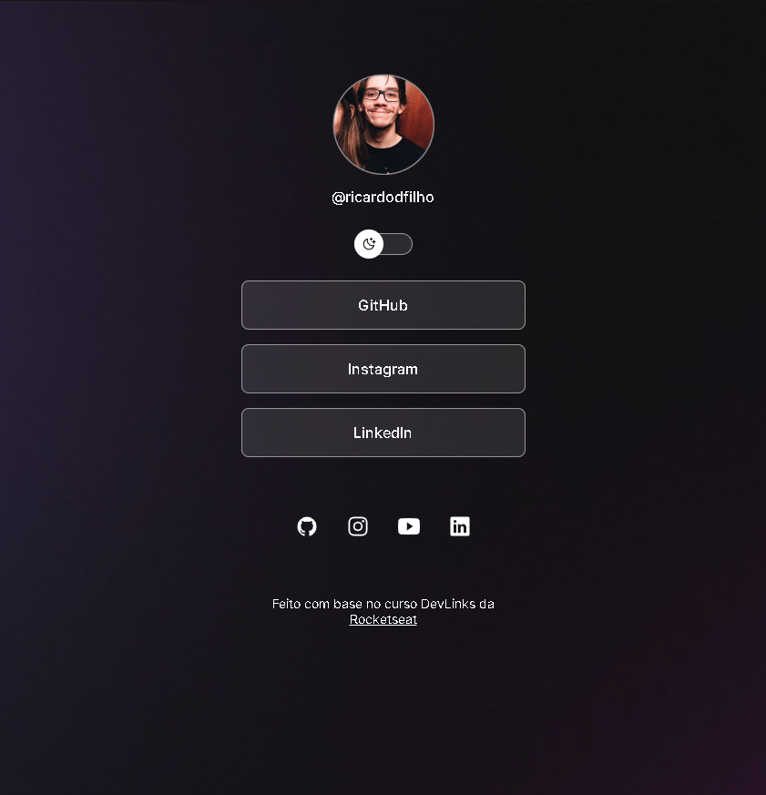
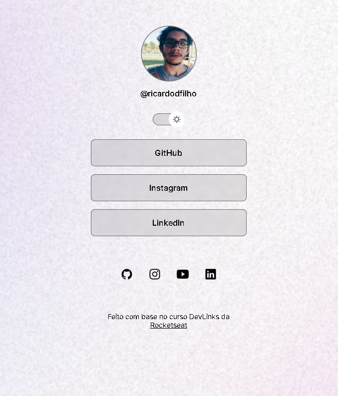

  
  

## Objetivo

O objetivo desse projeto foi praticar conhecimentos em HTML, CSS e JavasCript para construir uma página de cartão de visitas na WEB. Utilizei como base para isso o mini curso DevLinks da [RocketSeat](https://www.rocketseat.com.br).

Designei aos botões os links de minhas redes sociais e GitHub em dois formatos diferentes, mas planejo modificar esses botões no futuro para serem vinculados a novos projetos.

## Tecnologias

Esse projeto foi desenvolvido com as seguintes tecnologias:

- HTML e CSS
- JavaScript
- Git e Github
- Figma

## Visite meu projeto!

Acesse o site [aqui](https://ricardoddev.github.io/mini-portfolio/).
